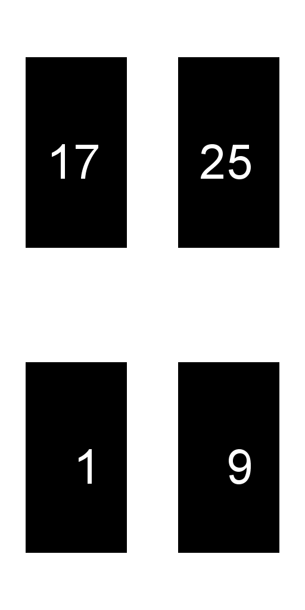
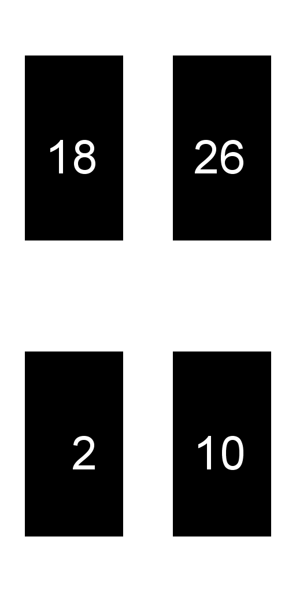
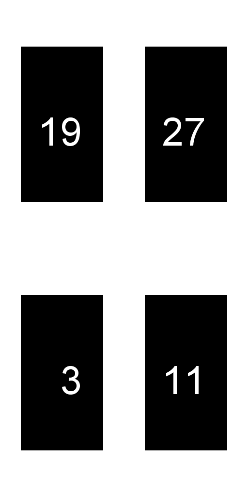
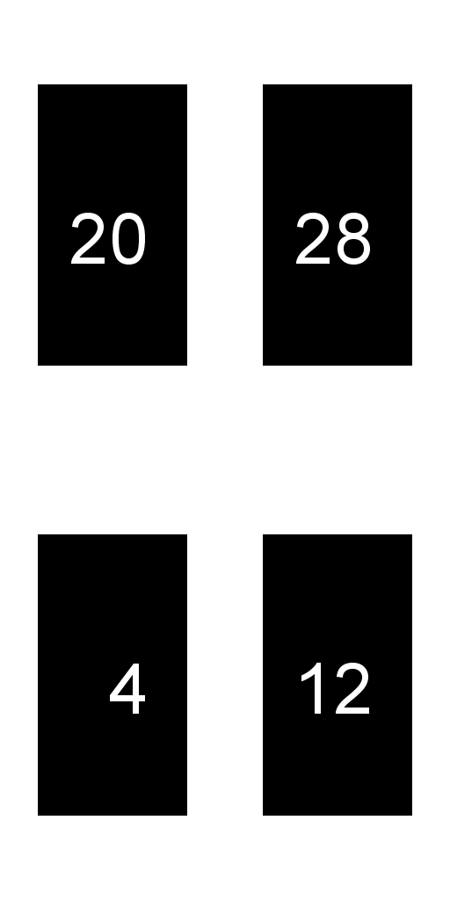
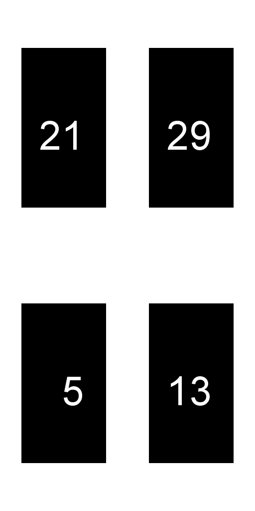
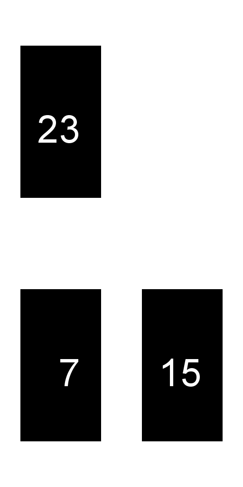
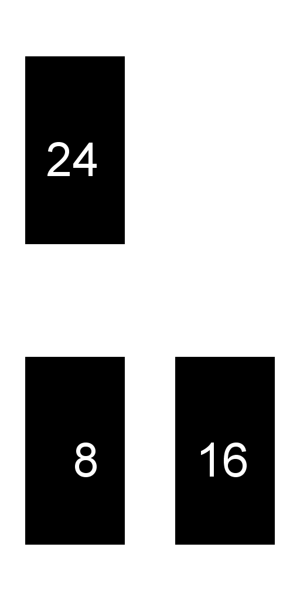

#FPBioimage
## Atlas Packing
For fast loading of z-stacks to the GPU, FPBioimage uses [texture atlases](https://en.wikipedia.org/wiki/Texture_atlas). To save download time, these texture atlases can be provided directly to FPBioimage.

To support volumetric images of up to 512x512x512, FPBioimage uses 8 texture atlases, each with a maximum size of 4096x4096. The location of each image slice on the texture atlas array is determined by a custom procedure, shown below in java and python.

Note that oversized image stacks must first be cropped or scaled to a maximum size of 512x512x512.

### Java
```java
int sliceWidth = volumeImage.width;
int sliceHeight = volumeImage.height;
int numSlices = volumeImage.depth; // Number of z-slices

int numberOfAtlases = 8; // Fixed for FPBioimage version 4

// Round image size up to next power of 2
int paddedSliceWidth = ceil2(sliceWidth);
int paddedSliceHeight = ceil2(sliceHeight);

int xOffset = (int)Math.floor((paddedSliceWidth - sliceWidth)/2);
int yOffset = (int)Math.floor((paddedSliceHeight - sliceHeight)/2);

// Calculate the xy size of the atlases, making atlases as square as possible
int slicesPerAtlas = (int)Math.ceil((float)numSlices/(float)numberOfAtlases);
int atlasWidth = ceil2(paddedSliceWidth); // ceil2() rounds up to next power of 2.
int atlasHeight = ceil2(paddedSliceHeight * slicesPerAtlas);
while ((atlasHeight > 2*atlasWidth) && (atlasHeight > sliceHeight)) {
	atlasHeight /= 2;
	atlasWidth *= 2;
}

// Initialise an array of 8 black 2D textures to become atlases
Image[] atlasArray = new Image[numberOfAtlases];
for (int i=0; i<numberOfAtlases; i++){
	atlasArray[i] = new Image(atlasWidth, atlasHeight, black);
}

// Fill out atlases with image slices
int slicesPerRow = (int)Math.floor((float)atlasWidth/(float)paddedSliceWidth);
for (int i=0; i<numSlices; i++){
	int atlasNumber = (int)((float)i % (float)numberOfAtlases);
	int locationIndex = (int)Math.floor((float)i/(float)numberOfAtlases);

	// Get slice
	Image slice = volumeImage.getSlice(i);

	// Put slice into atlas at the correct position
	int xStartPixel = (int)((float)locationIndex % (float)slicesPerRow) * paddedSliceWidth + xOffset;
	int yStartPixel = (int)Math.floor((float)locationIndex / (float)slicesPerRow) * paddedSliceHeight;

	// The following line should be uncommented for coordinate systems that start top-left
	//yStartPixel = atlasHeight - yStartPixel - paddedSliceHeight + yOffset;

	copySubImageToAtlas(sliceTexture, atlasArray[atlasNumber], xStartPixel, yStartPixel);
}
```

### Python
The following code makes a set of texture atlases out of a 170x320x30 volume image.

``` python
import math
import matplotlib.pyplot as plt
import numpy as np
from scipy import misc
from scipy import ndimage

def ceil2(x):
    # Round up to the next power of 2
    return 1<<(x-1).bit_length()

# In this example, image slices will be loaded from a folder
filepath = 'C:\\Users\\user\\Pictures\\example\\'
filenameprefix = 'example'

# Get/set volume image details
sliceWidth = 170
sliceHeight = 320
numSlices = 30

numberOfAtlases = 8 # Set for FPBioimage v4

# Calculate necessary variables
paddedSliceWidth = ceil2(sliceWidth)
paddedSliceHeight = ceil2(sliceHeight)

xOffset = math.floor((paddedSliceWidth-sliceWidth)/2)
yOffset = math.floor((paddedSliceHeight-sliceHeight)/2)

slicesPerAtlas = math.ceil(numSlices/numberOfAtlases)
atlasWidth = ceil2(paddedSliceWidth)
atlasHeight = ceil2(paddedSliceHeight * slicesPerAtlas)
while (atlasHeight > 2*atlasWidth) & (atlasHeight > sliceHeight):
    atlasHeight /= 2
    atlasWidth *= 2
atlasHeight = int(atlasHeight) # Cast back to int after division

# Create RGBA (4-channel) atlas array:
atlasArray = np.zeros((atlasHeight, atlasWidth, 4, numberOfAtlases), dtype=np.int32)

# Arrange slices into atlas
slicesPerRow = math.floor(atlasWidth/paddedSliceWidth)
for i in range(0, numSlices):
    atlasNumber = i % numberOfAtlases
    locationIndex = math.floor(i/numberOfAtlases)

    # Load from a file, in this example
    file = filepath + filenameprefix + str(i).zfill(4) + '.png'
    imslice = misc.imread(file, mode='RGBA')

    xStartPixel = (locationIndex % slicesPerRow) * paddedSliceWidth + xOffset
    yStartPixel = math.floor(locationIndex / slicesPerRow) * paddedSliceHeight + yOffset

    # Python coordinate system starts top-left:
    yStartPixel = atlasHeight - yStartPixel - paddedSliceHeight + 2*yOffset

    atlasArray[yStartPixel:yStartPixel+sliceHeight, xStartPixel:xStartPixel+sliceWidth, :, atlasNumber] = imslice

# Save the atlases
for a in range(0, numberOfAtlases):
    misc.imsave('atlas' + str(a) + '.png', atlasArray[:,:,:,a])

```

This python code results in the follow array of atlases:
>
>
>
>
>
>
>
>
